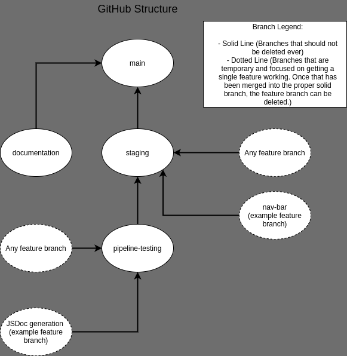

# cse110-sp21-group25

[JSDocs Site](https://cujodocs.github.io/CuJoDocumentation/)

[Working Prototype](https://cse110-sp21-group25.github.io/cse110-sp21-group25/project/src/index.html)

[Team Page](admin/team.md)

---

## GitHub Information:

Important GitHub Rules: (For helpful screenshots see [GitHub Guide (Coming Soon)]() )

1. Always make a branch off of the main ones (staging, pipeline-testing, and documentation) before doing anything else.
2. Write JSDoc comments in your code. [Handy Guide](https://devhints.io/jsdoc) See JSDocs Site at top for example of what this will look like once it is generated as a webpage.
3. If you have worked on the project that day please push to your respective branch before the end of the night and update the respective issue with details of your progress.
4. When creating a pull request please be careful that you are merging to the correct branch, consult above image if you are not completely sure. Also see the GitHub Guide for some helpful screenshots on how to initiate a pull request.

---

## Folder Structure (Given to us via Canvas):

- Overarching Decisions - we will eventually capture these as an ADR in markdown (Links to an external site.)(/specs/adrs will contain an individual document per major decision. There will be some initial ones that have to do with general project plan and approach, but more may be added as the project goes on. The main point of this capture is to explain why choices are made. As brainstorming may have your team settle on choices quickly capturing them in a document may be better than just mental consensus)
- User Centered Thinking Documents - we will produce personas (Links to an external site.), user stories (Links to an external site.), and potentially use cases. (Links to an external site.) (/specs/users will contain this but user stories chosen will also be represented as issues to work on)
- Interface Design Documents - we will initially capture "fat marker design" later extended with wireframes and high fidelity prototypes (/specs/interface/rough, /specs/interface/wireframes, /specs/interface/highfidelity These directories may contain single or multitude of documents)
- Project Roadmap - we will capture a roadmap of how the product will evolve both here in the quarter as well as ideas of how it might grow beyond the time we have with (/specs/roadmap.md)
- /specs/brainstorm/ will continue the distilled documents and diagrams you produced of the ideas you want to capture from your meetings. If you used Miro or another tool export the contents as an image, PDF, or markdown file to capture your appropriate assets.
- /admin/meetings/mmddyy-brainstorm.md (there may be multiple of these) - these are the general meeting notes of the brainstorming summarized including attendance, etc. Note this may be more exhaustive and procedural as opposed to what will be found in the planning document
