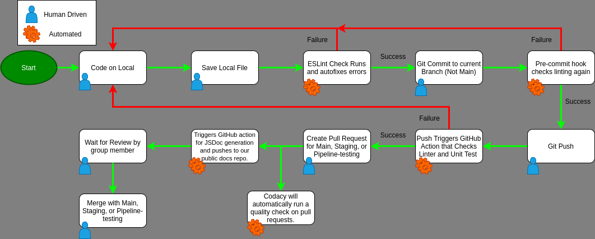

## Checkpoint 2 Pipeline Status:

- Phase1.mp4 on YouTube can be found [here](https://youtu.be/ftcBPvblmuo)

---

### Linting

- We decided to use standard-js as our style guide. We wanted to make sure that semicolons were checked and so our ESLint is using semistandard which is all of standard-js with the one altered rule of requiring semicolons.
- Built in locally to VSCode.
  - Using ESLint Extension to provide real time error checks and provide each developer with notice of any pieces of code that do not abide with our linting rules.
  - Set up the lint fix to run anytime the developer saves a .js file. Makes it super convenient to fix errors with a quick ctrl-s/cmd-s. (Has since been extended to also include Prettier running anytime a file is saved as well)
    - This also has the side benefit of avoiding all auto-fixable errors in the pipeline since you must save your file before committing it and therefore fixing all auto-fixable errors automatically.
- Created a pre-commit hook that runs the lint check before allowing a commit to be completed. This will catch those non auto-fixable errors such as undefined variables. The developer will have to manually go in and fix these.
  - Update from checkpoint 1. Was able to get this pre-commit hook disseminated to all users via a script that is run whenever their VSCode folder opens. Within this script we run `npm ci` which will in turn run the script that updates the place githooks are found `git config core.hooksPath ./project/config/.githooks`
- GitHub Workflow that runs everytime a push action is done. Currently runs a final lint check and will not allow for merging of code into another branch if that test fails.
- Added Prettier into the mix as well in order to help structure all the other files including CSS and any other files that our JS linter (ESLint) did not format for us.

**Issues**

- After a lot of small issues and working to find a way to make it easy to reproduce the local setup for everyone we ended up including the package.json and package-lock.json files within the repo so that a quick `npm ci` command ran by each person will set up their local environments completely.
- Getting the pre-commit hook working has been way more complicated then anticipated. Tried for a long time getting the original pre-commit hook from within the .git/hooks folder working but switched to using husky to run the hook. This ended up adding even more unneeded complexity to the process even though it did work. Revised the pre-commit situation by getting the original .git/hooks/pre-commit working. Then due to the fact that the .git folder is not tracked dissemenating the hook was difficult. Developed a fix that was described above.

---

### Code Quality

- Currently using Codacy in order to monitor code quality. Codacy is currently set up to run a check whenever anyone makes a pull request so that they can see the current grade of code and if there are any issues that cropped up.
- Still onboarding the rest of the time in regards to this tool since it is the newest addition to the pipeline. We were focused on getting all the other things compeletely working before including this piece.

**Issues**

- This was one of the last things to be implemented and so is still being fully setup. The amount of settings available is immense.

---

### Unit Tests

- Due to everyone's at least partial familiarity with Jest due to the lab, we decided to use that within our project as well. This should allow all developers to contribute to the tests without too much of an initial learning curve.
- Currently setup to run all of our unit tests within a GitHub action anytime a push action happens on GitHub. This happens parallel to the lint check and so if either fail then the developer will need to relook at the code they are pushing.
  - Once more tests are written we plan to include some partial testing within the local environment as well to help developers catch any errors sooner. Currently they are able to run `jest --coverage` from within the project directory to run all current tests.

**Issues**

- Due to us wanting to test each individual component before they go into the larger skeleton a decent amount of the code has had to be refactored in order to facilitate this. This should be completed soon so that we can write a lot more tests.

---

### Documentation Generation

- Developers have been asked to add JSDocs for all functions within their code.
- Currently JSDocs can be generated locally however at this point in the pipeline there is no reason to anymore.
  - JSDocs are generated within a GitHub action that triggers on a pull to one of our main branches (main, staging, pipeline-testing) and within this action once it has generated the JSDocs it pushes them to an outside repo that hosts the GitHub page for said docs. (https://cujodocs.github.io/CuJoDocumentation/). (Currently the only documentation is from the test code I added to verify it works.)

**Issues**

- Finding a way to actually push/commit to an outside repo was interesting to say the least. Ended up creating a seperate GitHub account and everythinh just to host it and to avoid any security issues.

---

**Other Notes**

- Cleaned up the repo a lot at the first portion of this sprint and added a config folder that holds any and all configuration files. During this process also realized that a lot of the configs can actually live inside the package.json file which is incredibly useful.
  - The act of moving config files around caused a lot of problems and so this process took a lot longer than I anticipated. Found some weird issues as well such as ESLint rules needing to be within a direct path to the files it is being used on, being in a parallel folder such as config would not work.
- Restructured the repo as a whole so now the root directory is completely clean from anything that can be placed elsewhere.
