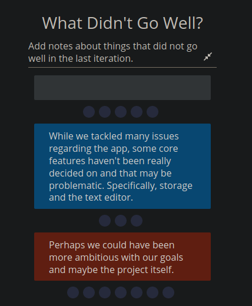

# Sprint 1 Retrospective Meeting Minutes
## Meeting Information
**Meeting Date/Time:** 16 May 2021, 8:00pm  
**Meeting Purpose:**  Retrospective for Sprint 1
**Meeting Location:** [https://ucsd.zoom.us/j/97927708709?pwd=NEhNV09WdHpjV1pzckZ6UHNGT3ZIQT09](https://ucsd.zoom.us/j/92066616876)
**Note Taker:** Jesse Wolf  

## Attendees
People who attended:
- Jesse Wolf
- Grady Gabriel
- Angel Hernandez-Llamas
- Kevin Wong
- Brian Wong
- Steven Nguyen

--- 

### Overall Screenshot of Main Activity:

--- 
#### What Went Well?

--- 

#### What Didn't Go Well?

--- 

### Action Items:

- The list of action items that we created during the second portion of the retrospective.

**Time Ended:** 9:00pm
