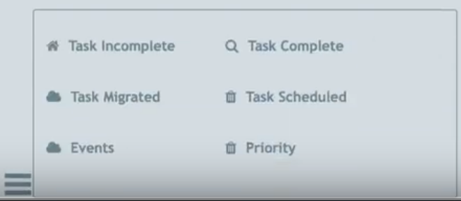

# Sprint 1 Review Meeting Minutes
## Meeting Information
**Meeting Date/Time:** 16 May 2021, 2:00pm  
**Meeting Purpose:** Review our first sprint  
**Meeting Location:** [https://ucsd.zoom.us/j/97927708709?pwd=NEhNV09WdHpjV1pzckZ6UHNGT3ZIQT09](https://ucsd.zoom.us/j/92066616876)
**Note Taker:** Jesse Wolf  

## Attendees
People who attended:
- Jesse Wolf
- Grady Gabriel
- Angel Hernandez-Llamas
- Kevin Wong
- Brian Wong
- Steven Nguyen

--- 

Overall Structure: Each member should attend and speak in the meeting and notes, screen captures or even demo videos should be taken.

Demo Video can be found on YouTube [here](https://youtu.be/uF6xLZLlgkg) and also within our repo at admin/videos/statusvideo1.mp4 [link to this file](./admin/videos/statusvideo1.mp4)

**Angel**
- Working on the tags. Created it as a web component. 
- Still need to set up methods to store and grab the tags. 

**Steven**
- Worked on the weekly/monthly board. Most of the implementation is done within a codepen. 
- Will send out the codepen when he gets home later. 

**Grady**
- Converted the symbols and mood indicator into web components.
- Also helped Kevin setting up the skeleton and adding the components into it.
- Will be adding a button into the mood portion.
- Made the clock (date portion) of the page as well.

**Kevin**
- Worked on setting up the skeleton from the figma design.
- Worked with Grady to get the components added within the skeleton. 

**Brian**
- Worked on the nav bar. Got all the buttons to work and have placeholders for all of the symbols right now. 
- We're not sure if we can grab the symbols from figma or not. 
- Icons are stubbed out for now. Will update once we have the symbols figured out.
- Also need to get the updated logo image from Issac when he gets back.

**Jesse**
- Worked with Simon to get CI/CD pipeline started.
- Accomplished getting linting done locally via a script that runs everytime a file is saved within VSCode.
- Github Workflow action that checks the linting again anytime a push is made to a branch.
- Pre-commit hook is working currently however dissemenation is a work in progress due to some folders not being tracked.

[Pipeline-Video-demonstration](https://youtu.be/ftcBPvblmuo)

Written breakdown can be found [here](/admin/cipipeline/phase1.md)

#### Important Notes:
- 8pm today for the retrospective.

**Time Ended:** 2:40
