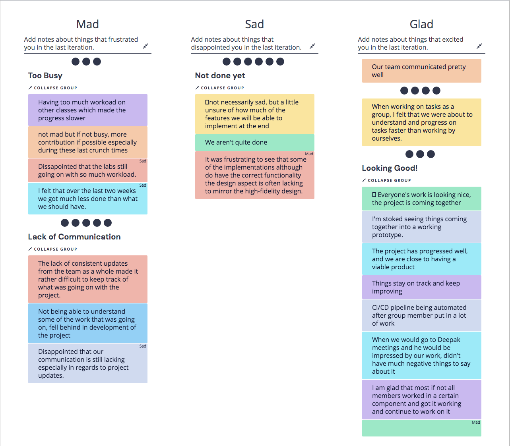
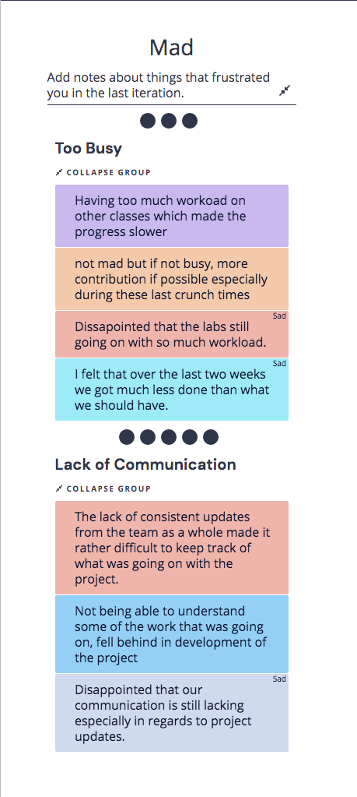
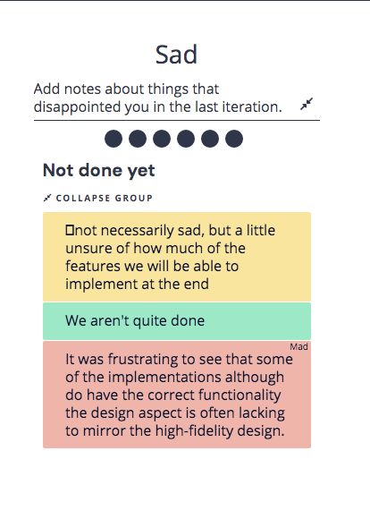
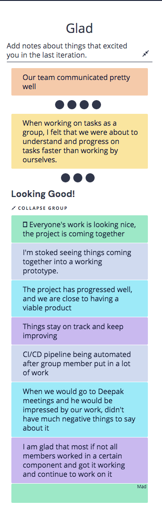
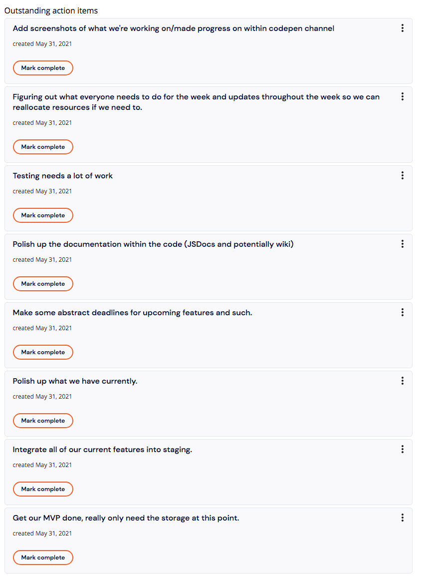

# Sprint 2 Retrospective Meeting Minutes
## Meeting Information
**Meeting Date/Time:** 31 May 2021, 8:00pm  
**Meeting Purpose:**  Retrospective for Sprint 2 \
**Meeting Location:** [https://ucsd.zoom.us/j/97927708709?pwd=NEhNV09WdHpjV1pzckZ6UHNGT3ZIQT09](https://ucsd.zoom.us/j/92066616876) \
**Note Taker:** Issac Garcia  

## Attendees
People who attended:
- Jesse Wolf
- Issac Garcia
- Simon Liu
- Grady Gabriel
- Angel Hernandez-Llamas
- Kevin Wong
- Brian Wong
- Steven Nguyen

**Facilitator**:
- Jesse Wolf
--- 

### Overall Screenshot of Main Activity:

--- 
### Add notes about things that frustrated you in the last iteration:

--- 

### Add notes about things that disappointed you in the last iteration.

--- 

### Add notes about things that excited you in the last iteration:

--- 

### Action Items:

- The list of action items that we created during the second portion of the retrospective.

**Time Ended:** 9:00pm
