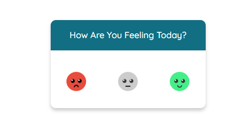
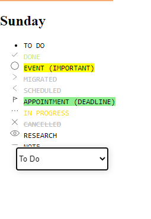
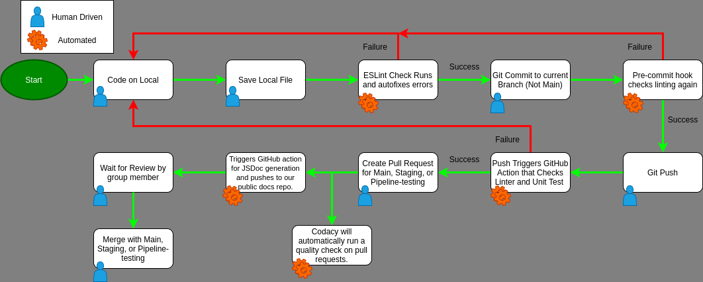

# Sprint 2 Review Meeting Minutes
## Meeting Information
**Meeting Date/Time:** 31 May 2021, 7:30pm  
**Meeting Purpose:** Review our second sprint.  
**Meeting Location:** [https://ucsd.zoom.us/j/97927708709?pwd=NEhNV09WdHpjV1pzckZ6UHNGT3ZIQT09](https://ucsd.zoom.us/j/92066616876) \
**Note Taker:** Issac Garcia 

## Attendees
People who attended:
- Jesse Wolf
- Issac Garcia
- Simon Liu
- Grady Gabriel
- Angel Hernandez-Llamas
- Kevin Wong
- Brian Wong
- Steven Nguyen

**Facilitator:**
- Jesse Wolf

--- 
**Overall Structure:** The group will go iterate from member to member and each individual should offer a description on what they have worked on the past two weeks. Screen sharing, demos, screenshots, insight are encouraged.

**Grady**
- Worked on the mood board adding some animation.
- Worked with **Kevin** on the Text editor component.

**Kevin**
- Developed the text editor component with **Grady** and added identifier features to the implementation.

**Angel**
- Developed tags utilizing Code.pen.
- **Brian** suggested that the tags should be independent and allowed to be customizable. 
  

**Issac**
- Collaborated with **Brian** to implement the CSS part of the weekly/monthly module to assimilate the team's high-fidelity design.
- Began the calendar implementation
  - At the end of the meeting it was decided that the calendar was not part of the team's MVP

**Brian**
- Developed the Javascript portion of the weekly/monthly component.
- Created his own version of text editor.
  - *Turns out it will not be utilized in the final product.*

**Simon**
- Set up the team's Github Wiki and set up easier and visually enticing navigation for team's repository.

&nbsp; &nbsp; &nbsp;&nbsp;&nbsp;&nbsp;&nbsp;&nbsp;&nbsp; [Team's Github Wiki](https://github.com/cse110-sp21-group25/cse110-sp21-group25/wiki)

**Steven**
- Researched *FullCalendar* api and attempted to implement such component to incorporate it to the team's BuJo.

**Jesse**
- Worked on the CI/CD pipeline.
- Accomplished getting JS Docs set up and integrated to Github.
- Set up testing for team to begin compiling them on individual files to have the testing not clash against each other.
- Successfully set up the puppeteer.

&nbsp; &nbsp; &nbsp;&nbsp;&nbsp;&nbsp;&nbsp;&nbsp;&nbsp; [Phase 1 - Checkpoint 2](https://github.com/cse110-sp21-group25/cse110-sp21-group25/blob/main/admin/cipipeline/phase1-checkpoint2.md)

#### Important Notes:
- 10 minute break before attending Spring 2 Retrospective Meeting

**Time Ended:** 8:00pm
