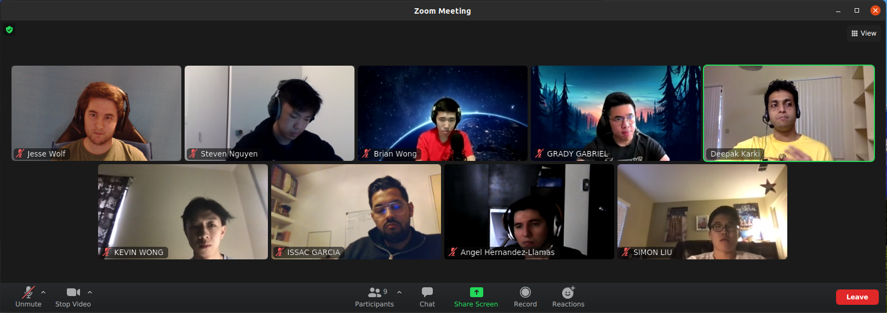

# TA Check In Meeting Minutes
## Meeting Information
**Meeting Date/Time:** 13 April 2021, 5:30pm
**Meeting Purpose:** Check in with Deepak (TA)  
**Meeting Location:** https://ucsd.zoom.us/j/97927708709?pwd=NEhNV09WdHpjV1pzckZ6UHNGT3ZIQT09
**Note Taker:** Jesse Wolf  

## Attendees
People who attended:
- Jesse Wolf
- Steven Nguyen
- Brian Wong
- Grady Gabriel
- Kevin Wong
- Issac Garcia
- Angel Hernandez-Llamas
- Simon Liu

Deepak: 
- First Year CS Masters Student
- Graduated in Undergrad with CS and then worked as a Software Dev for 5 years.
- Reason he's here is interest in Cogs department and the cool things they are working on. 
- Done a lot of JS and will be able to help with troubleshooting if we get stuck for an extended period of time. 

Overview: 
- Project 50% split between: 
  - Graded quality of Software. 
  - Software development process. MUCH MORE IMPORTANT. Make sure to do the process since that is what we really should be learning. 
    - Staff team will put out assignments per week to help guide us along in regards to most of this. 
    - Documentation is critical. Stand up notes, print planning, creating tickets, meeting notes. 
- Grading will be individual based. Will get a team grade and then will be bumped up or down by your individualized contribution throughout.
  - Team Grade will be put forward by Deepak and then the other 9 TA's and course staff will discuss and decide on the overall grade.
- The class will follow along with the weeks current project assignments. 
- If we follow the process we will get at least an A-.
- General Reccomendations:
  - The roles are not fixed. We can jump around. 
    - Developers: Responsible for developing a specific component/feature. Try to write QA tests.
    - Have a few person/a person that makes sure everything is running appropriately. One writing documentation and planning the meetings. Another making sure that we are keeping up with our assignments. 
    - Own one thing and you are responsible for that thing even if you delegate some parts of it. If you are struggling ask for help.
    - Team Level: Document literally everything. Try to have a story not just screenshots. One person needs to take ownership of the actual team itself too, checks all the assignments, gathers all the team members, collects all the documents for assignments. 
    - Have someone who will make sure everyone sticks to the SE practices. 
- Do we each need to submit each assignment on Canvas? Or just one of us from the group?
  - Group Assignments should be submitted by the leader or a single person and if it shows up as being submitted by everyone then you are good to go. Otherwise each of us should submit. 

**Time Ended:** 6pm